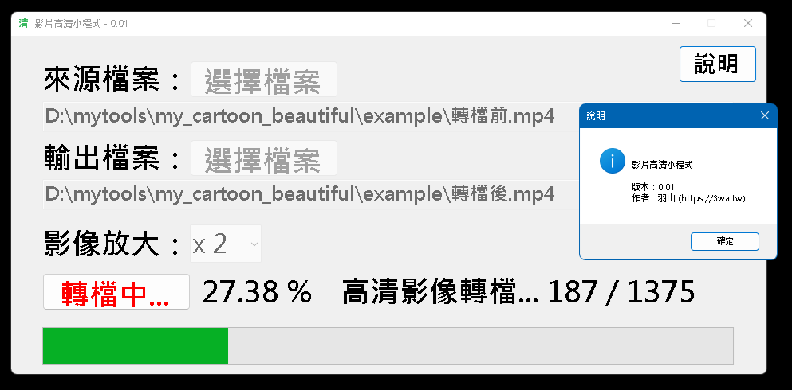
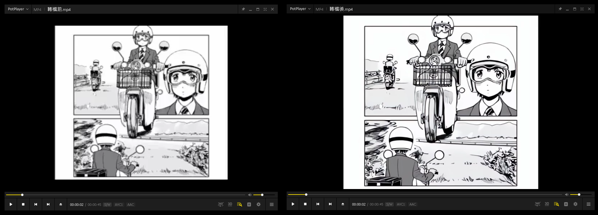

# my_cartoon_beautiful
我的影片清晰機，可以把老影片變高解析度的好工具

<h3>開發動機：</h3>
　　前陣子在網路上發現 https://github.com/xinntao/Real-ESRGAN-ncnn-vulkan
這個可以針對卡通圖片變成高解析度圖片的 project，產出的品質相當好，覺得可以整合加以利用。 
轉檔速度不是很快，需要有點耐心^^... 
有較好的顯卡GPU才能加快速度 

　　想法如下： 
	<ul>
		<li>1. 用 ffmpeg 把影片 → 單張圖片 (一秒30幀)</li>
		<li>2. 用 ffmpeg 把影片輸出聲音 (mp3)</li>
		<li>3. 用 Real-ESRGAN-ncnn-vulkan 把第 1 步驟作出的圖片，轉成高解析度圖片</li>
		<li>4. 用 ffmpeg 把高解析度圖片、mp3檔合併為新影片</li>
		<li>5. 刪除處理過程的暫存檔</li>
		<li>6. 將以上步驟作成 C# 小程式</li>
	</ul>
	 
　　最近在練習 C# 單機程式開發，當作練習作業
<h3>作者：羽山秋人 ( https://3wa.tw/ )</h3>
<h3>信箱：<a href="mailto:linainverseshadow@gmail.com">linainverseshadow@gmail.com</a></h3>
<h3>版權：完全免費的 MIT-License</h3>
<h3>最初開發日期：2024-07-28</h3>
<h3>最後更新日期：2024-07-28</h3>
<h3>版本：V0.01</h3>
<h3>下載位置：</h3>
1. 主程式(V0.01 beta版)：<a href="https://raw.githubusercontent.com/shadowjohn/my_cartoon_beautiful/master/release/V0.01/my_cartoon_beautiful.zip">https://raw.githubusercontent.com/shadowjohn/my_cartoon_beautiful/master/release/V0.01/my_cartoon_beautiful.zip</a>
 

 

執行畫面

 

 

影片產出範例

<a href="https://github.com/shadowjohn/my_cartoon_beautiful/tree/main/example" target="_blank">範例瀏覽</a>
 
 
<h3>使用方法：</h3>
<ul>
  <li>1. 選擇來源影像</li>
  <li>2. 選擇要存在哪</li>
  <li>3. 選擇影像放大倍數 x2 x3 x4 (越大越久...)</li>
  <li>4. 按下開始轉檔，等待成果</li>
</ul>
 
<h3>程式相依套件：</h3>
<ul>
  <li>1. ffmpeg windows binary static (ffmpeg version N-81947-gc45ba26)</li>
  <li>2. realesrgan-ncnn-vulkan (v0.2.0-windows)</li>
  <li>3. windows .net framework 4.6.2</li>
</ul>
 
<h3>版本說明：</h3>
V0.01 版 (2024-07-28)： 
初版簽入 
通過微軟掃毒：https://www.microsoft.com/en-us/wdsi/submission/48aea697-2456-458d-bbfa-bd442e6763f2

 
<h3>參考資料：</h3>
<ul>
  <li>1. ffmpeg: https://www.ffmpeg.org/download.html</li>
  <li>2. realesrgan-ncnn-vulkan: https://github.com/xinntao/Real-ESRGAN-ncnn-vulkan</li>
</ul>