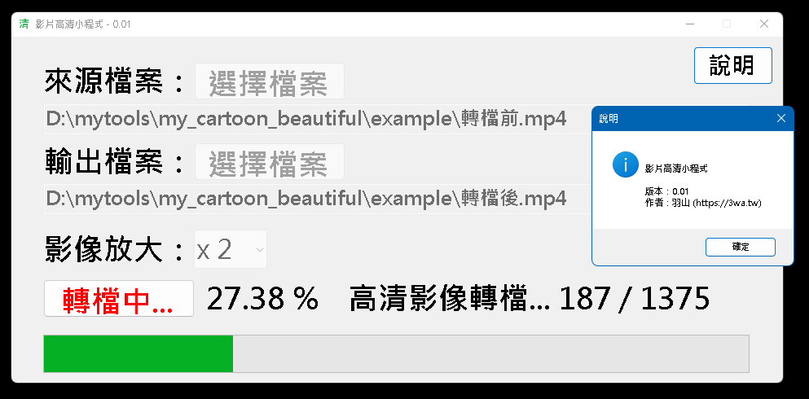
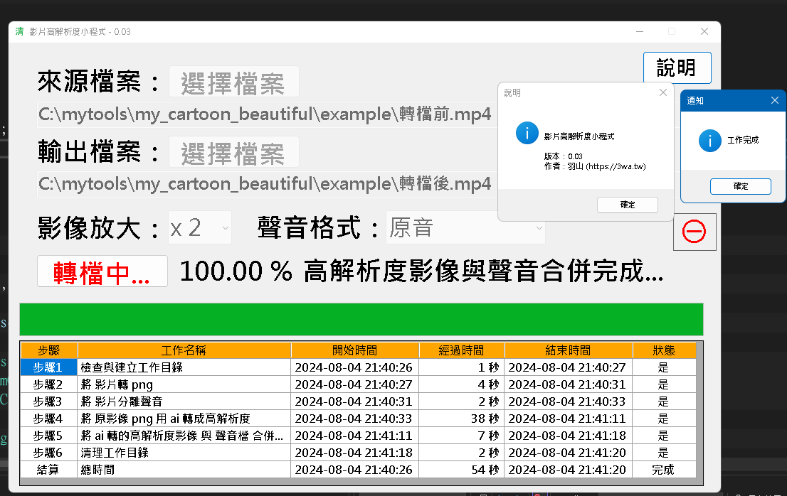
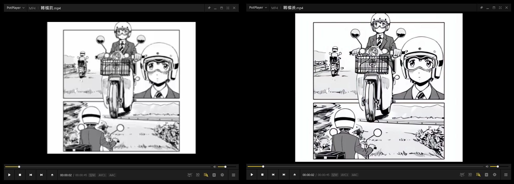

# my_cartoon_beautiful
我的影片清晰機，可以把老影片變高解析度的好工具

## 開發動機
前陣子在網路上發現 [Real-ESRGAN-ncnn-vulkan](https://github.com/xinntao/Real-ESRGAN-ncnn-vulkan) 這個可以針對卡通圖片變成高解析度圖片的 project，產出的品質相當好，覺得可以整合加以利用。

轉檔速度不是很快，需要有點耐心^^... 有較好的顯卡GPU才能加快速度。

想法如下：
1. 用 ffmpeg 把影片 → 單張圖片 (一秒30幀)
2. 用 ffmpeg 把影片輸出聲音 (wav)
3. 用 Real-ESRGAN-ncnn-vulkan 把第 1 步驟作出的圖片，轉成高解析度圖片
4. 用 ffmpeg 把高解析度圖片、wav檔合併為新影片
5. 刪除處理過程的暫存檔
6. 將以上步驟作成 C# 小程式

最近在練習 C# 單機程式開發，當作練習作業。

## 作者
羽山秋人 ( [https://3wa.tw/](https://3wa.tw/) )

## 聯絡方式
信箱：<a href="mailto:linainverseshadow@gmail.com">linainverseshadow@gmail.com</a>

## 版權
完全免費的 MIT-License

## 版本資訊
- 最初開發日期：2024-07-28
- 最後更新日期：2026-10-06
- 版本：v0.05（Windows x64）

## 下載位置
- v0.05：本機版本已完成；公開下載包尚未上傳。可依下方步驟建置，產物位於 `artifacts/release/my_cartoon_beautiful_v0.05.zip`。
- 主程式(V0.04 beta版)：[下載連結](https://raw.githubusercontent.com/shadowjohn/my_cartoon_beautiful/master/release/V0.04/my_cartoon_beautiful.zip)
- 主程式(V0.03 穩定版)：[下載連結](https://raw.githubusercontent.com/shadowjohn/my_cartoon_beautiful/master/release/V0.03/my_cartoon_beautiful.zip)

## 執行畫面



## 影片產出範例

[範例瀏覽](https://github.com/shadowjohn/my_cartoon_beautiful/tree/main/example)

## 使用方法
1. 選擇來源影像
2. 選擇要存在哪
3. 選擇影像放大倍數 x1 x2 x3 x4 (x1 為不放大，越大越久...)
4. 可視需求勾選「保留暫存」，方便除錯或留存中間 PNG
5. 按下開始轉檔，等待成果

## 程式相依套件

v0.05 採用 Windows x64 / .NET Framework 4.7.2。FFmpeg.AutoGen 9.0.1.1 呼叫匹配的 FFmpeg shared DLL；Real-ESRGAN 核心編譯為 `realesrgan_bridge.dll`，由 C# 直接呼叫。產品轉檔不啟動 ffmpeg.exe 或 Real-ESRGAN exe，仍保留 PNG 暫存、30 fps、SHA-256 去重及 x1–x4。

x1 不需要 AI DLL／模型／Vulkan GPU；x2–x4 需要支援 Vulkan 的顯卡與既有 animevideov3 模型。H.264 會先實際初始化 NVENC，失敗時回退 OpenH264。四種音訊保留 AAC／MP3／Vorbis／PCM 語意；沒有音軌會明確失敗。yuv420p 需要偶數輸出寬高，過小 AI 輸入（小於11x11）也會明確拒絕。

套件與 DLL 版本、SHA-256、上游 revisions 見 [native/dependencies.lock.json](native/dependencies.lock.json)。本專案程式維持 MIT；FFmpeg 本次固定組合為 LGPLv3，其他元件依各自授權，見 [第三方聲明](native/THIRD-PARTY-NOTICES.md)。上方 V0.04／V0.03 下載連結保留為歷史版本。

## 建置與本機驗證

需要 Windows x64、.NET Framework 4.7.2 targeting pack、.NET 10 SDK，以及含 C++/CMake 工具的 Visual Studio Build Tools。建置腳本下載具 SHA-256 驗證的原生來源到 ignored `artifacts`，不需要安裝完整 Vulkan SDK。模型沿用 repository 的既有檔案。

```powershell
./tools/prepare_native.ps1
./tools/build_native.ps1 -Configuration Release -RequireGpu
./tools/create_smoke_fixtures.ps1
# 舊 CLI 只用於產生開發測試 fixture，不放進產品包。
dotnet build tests/NativeMediaSmokeTests/NativeMediaSmokeTests.csproj -c Release
./tests/NativeMediaSmokeTests/bin/Release/net472/NativeMediaSmokeTests.exe ./artifacts/native-runtime/ffmpeg --decode --audio --pipeline-stages --mux --lifecycle
dotnet run --project tests/ProcessRunnerTests/ProcessRunnerTests.csproj
dotnet run --project tests/UtilityTests/UtilityTests.csproj
./tools/build_release.ps1 -Version v0.05 -SkipBuild
./tools/verify_native_release.ps1 -PackagePath ./artifacts/release/my_cartoon_beautiful_v0.05 -RequireGpu
```

`build_release.ps1` 預設會準備相依、編譯 native/managed，再產出 ZIP／SHA-256；`-SkipBuild` 使用已建置的本機成果。驗證工具從其他工作目錄、隔離的 AppDomain 載入包內 managed/native DLL，檢查 SHA-256，啟動視窗並跑 x1／選用 x2 完整轉檔。測試工具、CLI、PDB 不進產品包。

取消會等候目前 native/GPU 工作收尾；關窗也會等候。輸出 MP4 完整回讀影音後才替換指定檔案。勾選保留暫存時，成功、取消與失敗都保留該次 GUID 工作目錄；否則待工作釋放資源後清理。

CI 建置 bridge 並跑 CPU decode/audio/x1 package smoke；若 runner 有系統 Vulkan loader 也跑 ABI，缺少時明列 NOT-RUN；GPU 對照、NVENC、長片與真人操作屬本機驗證，不能以 CI 代替。`--upscale` 的精確比較另需 legacy baseline 與 `tools/prepare_realesrgan_reference.ps1` 產生的相同工具鏈上游參考圖。`--endurance` 需 `create_smoke_fixtures.ps1 -IncludeEndurance`，記錄五次短片與一段十分鐘影片的同程序資源數值。

本輪只產生本機測試包，未發布。公開散布前仍需準備固定 FFmpeg 組合及其靜態相依的完整對應原始碼／建置資料並隨發佈提供；固定來源連結不等於已組裝完成的 source bundle。

## 版本說明
v0.05 版 (2026-10-06)：原生 DLL 整合
1. 升級為 .NET Framework 4.7.2 + x64。
2. FFmpeg 改用 FFmpeg.AutoGen 呼叫 shared DLL；Real-ESRGAN 核心編譯為 DLL，轉檔流程不再啟動兩支外部 exe。
3. 保留 PNG 暫存、30 fps、SHA-256 去重、x1–x4 與四種音訊選項。
4. 取消與關窗會等候 native 工作清理；輸出完成並回讀驗證後才替換目的檔案。
5. 補齊 managed/native DLL、模型、授權與逐檔 SHA-256 的打包及隔離驗證。
6. 本機自動化轉檔、取消與資源生命週期測試通過，並取得使用者實際成功轉檔回饋。

以下為納入 v0.05 的前期開發紀錄；外部程序相關實作已由本版 DLL 流程接替。

開發中 (2026-05-27)：CI 修正
1. GitHub Actions workflow 更新 `actions/upload-artifact@v4`，避免 v3 退役造成 build 失敗。
2. 同步更新 `actions/checkout@v4`、`microsoft/setup-msbuild@v2`、`NuGet/setup-nuget@v2`。

開發中 (2026-05-27)：P2 功能整理與發佈流程
1. 新增 x1 不放大模式，會跳過 Real-ESRGAN，直接複製原始 PNG 後合成 MP4。
2. 將轉檔進度區間集中成常數，方便後續調整權重。
3. 將音訊暫存變數命名由 `wav_file` 整理為 `audioFile`。
4. 新增 `tools/build_release.ps1`，可自動 build、整理輸出、壓 zip、產 SHA-256。

開發中 (2026-05-27)：P1 穩定性與一致性修正
1. 重複 frame 判斷改用 SHA-256，取代原本的 MD5。
2. 修正 `deltree` 成功仍回傳 false 的問題，失敗時保留 `last_error`。
3. 補回「保留暫存」UI 選項，轉檔中會鎖定，完成後會顯示暫存目錄。
4. step2 進度改讀 ffmpeg `-progress pipe:1` 的 `frame=`，不再每秒掃描 PNG 目錄推估進度。
5. 新增 `tests/UtilityTests`，可用 `dotnet run --project tests\UtilityTests\UtilityTests.csproj` 驗證 utility 行為。

開發中 (2026-05-27)：P0 穩定性修正
1. 讓舊式 .NET Framework WinForms 專案可用新版 `dotnet build` 建置。
2. 新增 `ProcessRunner`，集中處理外部 process 的 stdout/stderr、ExitCode、取消、timeout 與 log。
3. `step2_sourceFile_to_png` 不再只靠 PNG 數量接近總幀數就提前成功，改為等待 ffmpeg 正式結束並檢查 ExitCode。
4. step2 ffmpeg 失敗時保留 `tmp/*_step2_ffmpeg.log`，方便追錯。
5. 新增 `tests/ProcessRunnerTests`，可用 `dotnet run --project tests\ProcessRunnerTests\ProcessRunnerTests.csproj` 驗證 process runner。

V0.04 版 (2024-10-13)：更新內容
14. (2024-10-12 Done) 轉檔魯冰花480p 會卡死在 video → png 轉換與聲音轉換的步驟
通過微軟掃毒：[掃毒結果] https://www.microsoft.com/en-us/wdsi/submission/85571e6d-59d2-46c2-b0d5-be3e6ab2871a

V0.03 版 (2024-08-04)：更新內容
12. (2024-08-04 Done) 【V0.03】聲音格式：AAC libmp3lame OGG 原音可選擇
通過微軟掃毒：[掃毒結果] https://www.microsoft.com/en-us/wdsi/submission/3981004f-8c25-45b6-b35e-f5bf906deadb

V0.02 版 (2024-08-04)：更新內容
 1. (2024-08-04 Done) 【V0.02】轉檔時，每個步驟有開始、結束時間
 2. (2024-08-03 Done) 【V0.02】自動切換 h264 或 h264_nvenc
 3. (2024-08-03 Done) 【V0.02】轉檔時，可以選擇是否要保留暫存檔
 4. (2024-08-03 Done) 【V0.02】在處理 step4_sourcePng_to_aiPng ，先判斷是否有重複檔案，有的話就不處理，重複檔案用 md5_file 檢查
 5. (2024-08-04 Done) 【V0.02】轉檔過程時，直接按 X 離開，還在轉檔的 ffmpeg 或 real-esrgan-ncnn 並沒有結束
 6. (2024-08-04 Done) 【V0.02】文字調整，影片檔分離 wav 改成 影片分離聲音
 7. (2024-08-04 Done) 【V0.02】轉檔時，忽然按下 X 結束程式會先詢問使用者是否要強制結束，再結束程式
 8. (2024-08-04 Done) 【V0.02】最後加上 總時間 結算時間
 9. (2024-08-04 Done) 【V0.02】讓使用者自行指定原音，或是轉 mp3 可減少檔案大小
10. (2024-08-04 Done) 【V0.02】結束時的 MessageBox 置頂
11. (2024-08-04 Done) 【V0.02】滑鼠經過 ㊉ ㊀ 會變成手指指標
通過微軟掃毒：[掃毒結果] https://www.microsoft.com/en-us/wdsi/submission/b919607d-3279-4575-b904-d457189df292

V0.01 版 (2024-07-28)：初版簽入
通過微軟掃毒：[掃毒結果] https://www.microsoft.com/en-us/wdsi/submission/187d28a1-810c-4ef8-8702-871c6ba6fccd


	
## 參考資料
1. [ffmpeg](https://www.ffmpeg.org/download.html)
2. [realesrgan-ncnn-vulkan](https://github.com/xinntao/Real-ESRGAN-ncnn-vulkan)

## 待處理
 1. (2024-08-04 Done) 【V0.02】轉檔時，每個步驟有開始、結束時間
 2. (2024-08-03 Done) 【V0.02】自動切換 h264 或 h264_nvenc
 3. (2024-08-03 Done) 【V0.02】轉檔時，可以選擇是否要保留暫存檔
 4. (2024-08-03 Done) 【V0.02】在處理 step4_sourcePng_to_aiPng ，先判斷是否有重複檔案，有的話就不處理，重複檔案用 md5_file 檢查
 5. (2024-08-04 Done) 【V0.02】轉檔過程時，直接按 X 離開，還在轉檔的 ffmpeg 或 real-esrgan-ncnn 並沒有結束
 6. (2024-08-04 Done) 【V0.02】文字調整，影片檔分離 wav 改成 影片分離聲音
 7. (2024-08-04 Done) 【V0.02】轉檔時，忽然按下 X 結束程式會先詢問使用者是否要強制結束，再結束程式
 8. (2024-08-04 Done) 【V0.02】最後加上 總時間 結算時間
 9. (2024-08-04 Done) 【V0.02】讓使用者自行指定原音，或是轉 mp3 可減少檔案大小
10. (2024-08-04 Done) 【V0.02】結束時的 MessageBox 置頂
11. (2024-08-04 Done) 【V0.02】滑鼠經過 ㊉㊀ 會變成手指指標
12. (2024-08-04 Done) 【V0.03】聲音格式：AAC libmp3lame OGG 原音可選擇
13. (2026-05-27 Done) 增加 x1 不放大倍率
14. (2024-10-12 Done) 【V0.04】轉檔魯冰花會卡死在 video → png 轉換與聲音轉換的步驟
15. (2026-05-27 Done) 改用 sha256 取代 md5 hash
